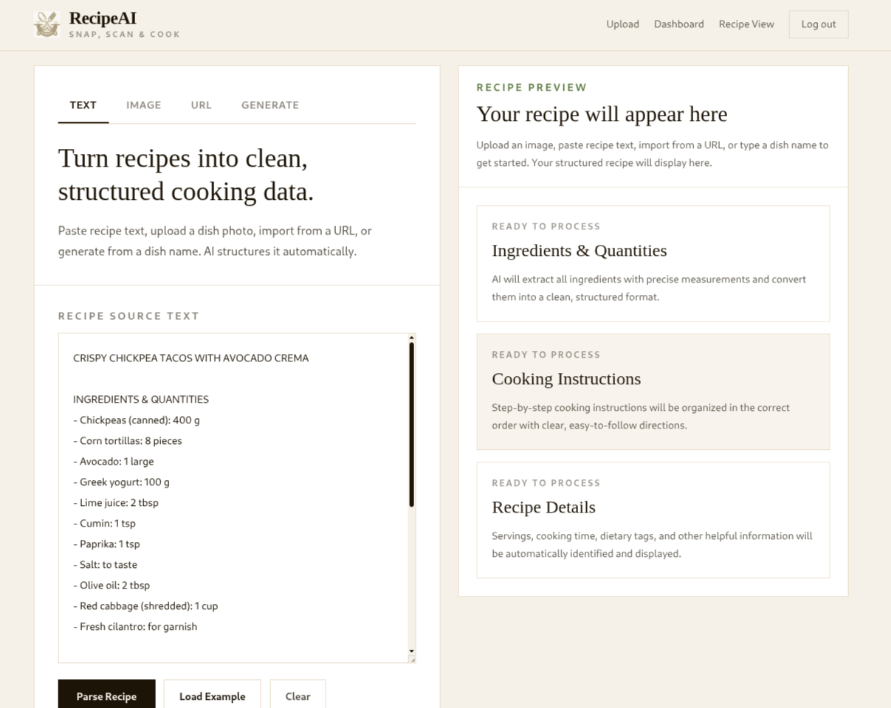
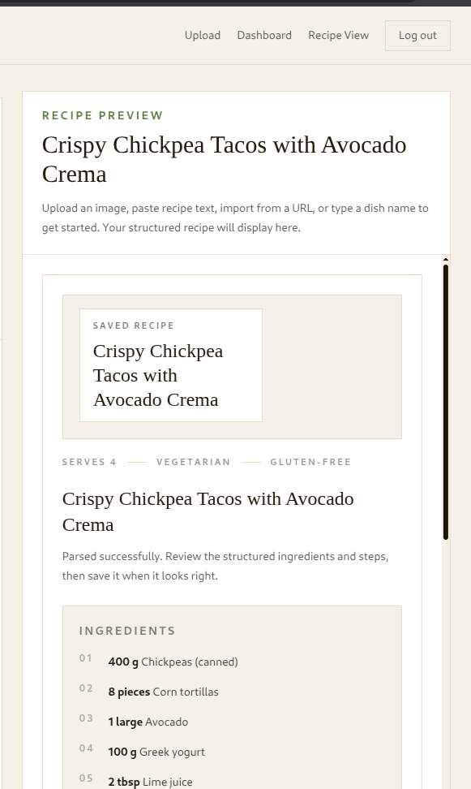
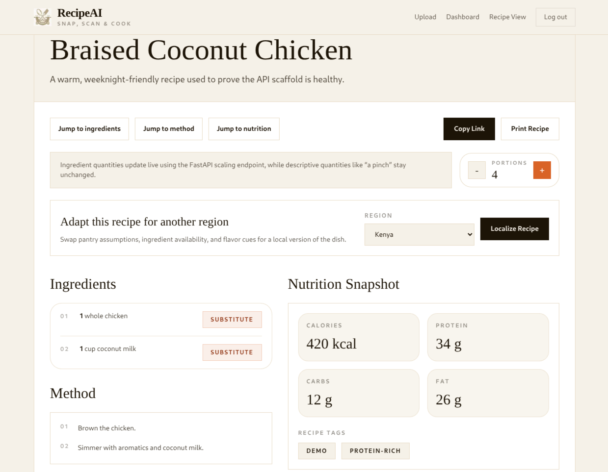
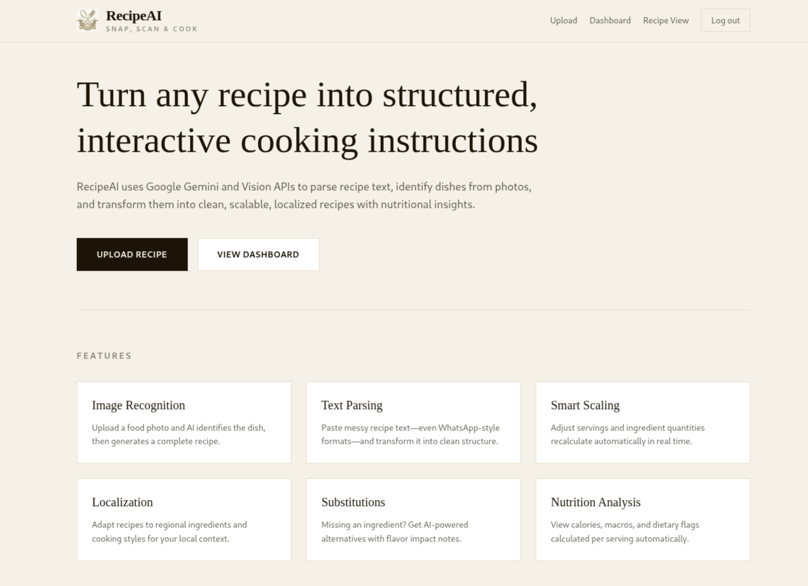
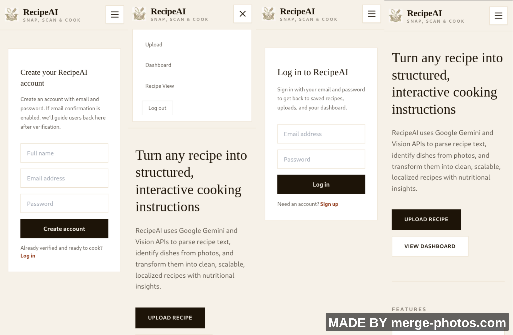

# 🍽️ RecipeAI — Snap, Scan & Cook

> Upload a food photo or paste any recipe text. AI structures it, analyzes it, and makes it interactive.


---

## What is RecipeAI?

RecipeAI is a full-stack AI-powered recipe assistant that lets users:

- **Upload a food photo** — AI identifies the dish and fetches a structured recipe
- **Paste any recipe text** — even messy, emoji-heavy WhatsApp-style formats — and AI parses and structures it automatically
- **Scale servings** — ingredient quantities adjust in real time
- **Localize recipes** — adapt dishes to local/regional ingredients (e.g. a Kenyan twist on a European dish)
- **Substitute ingredients** — "I don't have thyme, what can I use?"
- **Get nutritional info** — calories, macros, and dietary flags per serving

---

## Tech Stack

| Layer | Technology |
|---|---|
| Frontend | [Next.js 15](https://nextjs.org/) (App Router, Tailwind CSS) |
| Backend / API | [FastAPI](https://fastapi.tiangolo.com/) (Python) |
| AI — Text & Reasoning | [Google Gemini API](https://ai.google.dev/) (free tier) |
| AI — Image Recognition | [Google Cloud Vision API](https://cloud.google.com/vision) (free tier) |
| Auth | [Supabase Auth](https://supabase.com/auth) |
| Database | [Supabase](https://supabase.com/) (PostgreSQL) |
| Frontend Deployment | [Vercel](https://vercel.com/) |
| Backend Deployment | [Render](https://render.com/) |

---

## Project Structure

```
recipeai/
├── frontend/                  # Next.js app
│   ├── app/
│   │   ├── (auth)/            # Login / signup pages
│   │   ├── dashboard/         # User saved recipes
│   │   ├── recipe/[id]/       # Single recipe view
│   │   └── upload/            # Upload & paste flow
│   ├── components/
│   │   ├── RecipeCard.tsx
│   │   ├── IngredientList.tsx
│   │   ├── ServingScaler.tsx
│   │   └── NutritionBadge.tsx
│   ├── lib/
│   │   ├── supabase.ts        # Supabase client
│   │   └── api.ts             # FastAPI client helpers
│   └── public/
│
├── backend/                   # FastAPI app
│   ├── main.py
│   ├── routers/
│   │   ├── recipes.py         # Parse, structure, save
│   │   ├── vision.py          # Image recognition
│   │   ├── ai.py              # Gemini AI calls
│   │   └── auth.py            # Supabase JWT verification
│   ├── models/
│   │   └── recipe.py          # Pydantic models
│   ├── services/
│   │   ├── gemini_service.py
│   │   └── vision_service.py
│   └── requirements.txt
│
├── supabase/
│   └── migrations/            # DB schema SQL files
│
├── .env.example
├── .gitignore
└── README.md
```

---

## Getting Started

### Prerequisites

- Node.js >= 18
- Python >= 3.10
- A [Supabase](https://supabase.com) project
- A [Google AI Studio](https://aistudio.google.com) API key (Gemini — free)
- A [Google Cloud](https://console.cloud.google.com) project with Vision API enabled (free tier)

---

### 1. Clone the repo

```bash
git clone https://github.com/your-username/recipeai.git
cd recipeai
```

---

### 2. Set up environment variables

Copy the example env file and fill in your keys:

```bash
cp .env.example .env
```

```env
# Supabase
NEXT_PUBLIC_SUPABASE_URL=your_supabase_url
NEXT_PUBLIC_SUPABASE_ANON_KEY=your_supabase_anon_key
SUPABASE_SERVICE_ROLE_KEY=your_service_role_key

# Google Gemini
GEMINI_API_KEY=your_gemini_api_key

# Google Cloud Vision
GOOGLE_APPLICATION_CREDENTIALS=path/to/your/credentials.json

# FastAPI
BACKEND_URL=http://localhost:8000
```

---

### 3. Frontend setup

```bash
cd frontend
npm install
npm run dev
```

Frontend runs at `http://localhost:3000`

---

### 4. Backend setup

```bash
cd backend
python -m venv venv
source venv/bin/activate        # Windows: venv\Scripts\activate
pip install -r requirements.txt
uvicorn main:app --reload
```

Backend runs at `http://localhost:8000`

API docs available at `http://localhost:8000/docs`

---

### 5. Supabase DB setup

Run the migration in `supabase/migrations/` via the Supabase dashboard SQL editor, or use the Supabase CLI:

```bash
supabase db push
```

---

## Database Schema (Supabase)

```sql
-- Users handled by Supabase Auth

create table recipes (
  id uuid primary key default gen_random_uuid(),
  user_id uuid references auth.users(id) on delete cascade,
  title text not null,
  description text,
  image_url text,
  source_text text,             -- original pasted/uploaded input
  structured_data jsonb,        -- parsed ingredients, steps, etc.
  nutrition jsonb,
  servings integer default 4,
  created_at timestamptz default now()
);

create table saved_recipes (
  id uuid primary key default gen_random_uuid(),
  user_id uuid references auth.users(id) on delete cascade,
  recipe_id uuid references recipes(id) on delete cascade,
  created_at timestamptz default now()
);
```

---

## API Endpoints

| Method | Endpoint | Description |
|---|---|---|
| `POST` | `/api/recipes/parse` | Parse raw recipe text using Gemini AI |
| `POST` | `/api/vision/identify` | Identify dish from uploaded image |
| `GET` | `/api/recipes/{id}` | Fetch a single saved recipe |
| `POST` | `/api/recipes/save` | Save structured recipe to Supabase |
| `GET` | `/api/recipes/user/{user_id}` | Get all recipes for a user |
| `POST` | `/api/recipes/substitute` | Get ingredient substitutions |
| `POST` | `/api/recipes/localize` | Localize recipe to a region |

---

## AI Features In Detail

### Recipe Parser (Gemini)
Sends raw text (including emojis, informal formatting) to Gemini with a structured prompt. Returns clean JSON with `title`, `ingredients[]`, `steps[]`, `servings`, and `tags`.

### Image Recognition (Google Vision)
Uploads image to Vision API → gets label annotations → uses top labels as search terms → Gemini generates or fetches a matching recipe.

### Ingredient Substitution (Gemini)
Sends ingredient + dish context → returns 2–3 substitution options with notes on flavor impact.

### Localization (Gemini)
Sends full recipe + target region → returns adapted recipe with locally available ingredient equivalents.

---

## Deployment

### Frontend → Vercel

```bash
# Push to GitHub, connect repo on vercel.com
# Add all NEXT_PUBLIC_* env vars in Vercel dashboard
```

### Backend → Render

```bash
# Push backend/ to GitHub
# Create a new Web Service on render.com
# Build command: pip install -r requirements.txt
# Start command: uvicorn main:app --host 0.0.0.0 --port 10000
# Add all env vars in Render dashboard
```

---

## Screenshots

<details>
<summary>📝 Text Parser - Upload Recipe Text</summary>



</details>

<details>
<summary>✨ Parsed Recipe Preview</summary>



</details>

<details>
<summary>🍳 Complete Recipe View</summary>



</details>

<details>
<summary>🏠 Landing Page (Desktop)</summary>



</details>

<details>
<summary>📱 Mobile View</summary>



</details>

---

## Contributing

Pull requests are welcome. For major changes, please open an issue first.

---

## License

[MIT](./LICENSE)

---

## Author

Built by **Daniel Giathi** — a Software Engineer passionate about building AI-powered tools for everyday life.

[](https://linkedin.com/in/daniel-giathi)
[](https://github.com/Giathi-Daniel)
